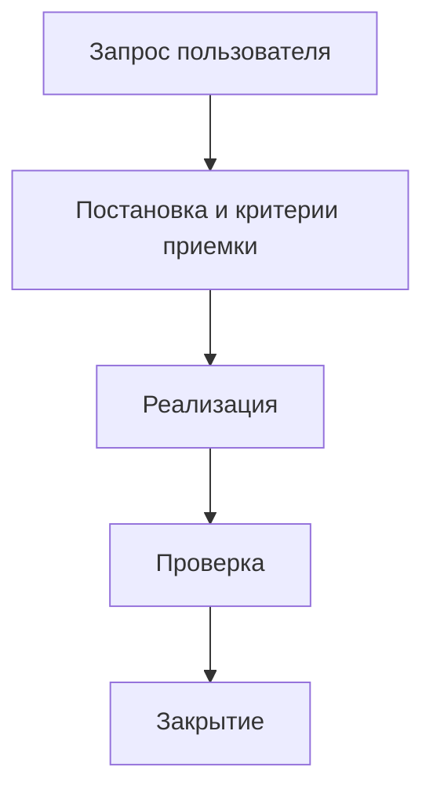

# Положение о цикле разработки и работе агентов

Этот документ задает рабочий порядок для разработки `alterios-mcp`, настройки
Alterios-проектов через MCP и командной работы агентов. Цель положения -
ускорить разработку без потери проверяемости: каждая задача должна заканчиваться
рабочим результатом, понятной проверкой и решением, что попадает в Git.

Соблюдение этого положения обязательно для всех задач, где Codex меняет MCP,
skills, agents, документацию, live-конфигурацию Alterios или выполняет
write-like операции. Если для конкретной задачи нужен отход от положения,
исключение фиксируется явно: что пропускается, почему это безопасно, кто
принимает риск и какой компенсирующий контроль остается.

## 1. Область применения

Положение применяется к четырем типам работ:

1. Разработка MCP: tools, CLI, tests, validators, сценарные команды.
2. Развитие skills и агентов: правила, роли, handoff, reusable playbooks.
3. Live-настройка Alterios: материалы, поля, представления, формы, скрипты,
   BPMN, отчеты, иконки, пользователи и роли.
4. Документация: README, инструкции администратора/пользователя, постановки,
   ГОСТ-ориентированные материалы и внутренние регламенты.

Если задача относится только к конкретному бизнес-проекту Alterios, в Git
попадают только обезличенные reusable-улучшения. Реальные URL, project id,
материалы, пользователи, HAR, screenshots, write-journal и сырые выгрузки
остаются локально или в закрытом хранилище.

## 2. Базовый цикл

Любая нетривиальная задача проходит один и тот же цикл:

```text
Запрос -> Постановка -> Декомпозиция -> Реализация -> Проверка -> Документация -> Git-решение -> Закрытие
```

Цикл не является формальностью. Он нужен, чтобы не начинать запись без
понимания цели, не смешивать бизнесовый контекст с reusable-разработкой и не
объявлять задачу закрытой без проверенного результата.

### 2.1. Запрос

На входе фиксируются:

- что пользователь хочет получить в конце;
- где выполняется работа: repo, конкретный Alterios instance, конкретный project;
- нужна ли live-запись или достаточно read-only анализа;
- является ли результат reusable-улучшением MCP или только бизнесовой настройкой;
- есть ли ограничения: не пушить, не менять существующие scripts, не трогать
  реальные данные, работать только в тестовом контуре.

Если запрос неоднозначный, Lead Engineer выбирает практичное допущение и
двигается дальше. Уточнение задается только если без ответа есть риск сломать
данные, записать не туда или сделать необратимое действие.

### 2.2. Постановка

Постановка переводит запрос в проверяемую задачу. Для маленькой задачи это 3-5
строк в рабочем сообщении. Для большой задачи это отдельный artifact или раздел
status-документа.

Минимальный состав постановки:

- цель;
- пользовательский сценарий;
- затрагиваемые сущности: content types, fields, views, forms, scripts, BPMN,
  reports, groups, users/roles;
- Mermaid-схема, которая показывает основной поток, структуру данных,
  взаимодействие компонентов или жизненный цикл;
- acceptance criteria;
- ограничения и риски;
- что будет считаться доказательством результата.

Для бизнесовой задачи аналитик дополнительно описывает роли пользователей,
исключения, права, жизненный цикл данных и ожидаемое поведение интерфейса.

Mermaid-схема обязательна для постановки. Тип схемы выбирается по задаче:

- `flowchart` - основной пользовательский сценарий, этапы процесса или
  последовательность действий агентов;
- `erDiagram` - сущности, поля и связи материалов;
- `sequenceDiagram` - взаимодействие пользователя, формы, MCP tool, API и
  скриптов;
- `stateDiagram-v2` - жизненный цикл материала, процесса, задачи или статуса.

Минимальный шаблон для небольшой постановки:



### 2.3. Декомпозиция

Декомпозиция превращает постановку в рабочие slice. Каждый slice должен давать
проверяемый результат, а не просто "исследовать еще".

Правильная декомпозиция отвечает на вопросы:

- какие агенты нужны и зачем;
- какая зона ответственности у каждого агента;
- какие файлы, tools или live-объекты можно менять;
- какие действия выполняются read-only;
- где нужен dry-run;
- какие проверки закроют slice.

Если работа большая, сначала закрывается самый ценный slice: например, один
рабочий материал-модуль, одна эталонная форма, один script flow, один report tab.

### 2.4. Реализация

Реализация выполняется минимально достаточным способом. Предпочтение отдается
готовым typed tools, сценарным tools, helper scripts и validators. Generic REST
используется как временный путь только если typed tool еще не существует или
workflow исследуется.

Правила реализации:

- не менять чужие live scripts без отдельного описания риска;
- не переписывать форму целиком, если достаточно patch tabs/actions;
- не переносить `iconId` между проектами;
- не использовать непроверенные route shapes как факт;
- при повторяемом действии сразу рассматривать автоматизацию.

### 2.5. Проверка

Проверка выбирается по типу изменения:

- code change: unit tests, targeted tests, `pytest`, `py_compile`;
- MCP behavior: replay smoke, tool registry check, dry-run/write gate tests;
- Alterios write: dry-run, apply, readback, health summary;
- UI-facing form/view: UI evidence или browser readback;
- report: source rows, `report/full`, layout/render validation;
- docs/skills: sensitive scan, link sanity, diff review.

Результат нельзя называть verified, если есть только успешный save без readback
или видимого результата там, где пользователь должен видеть UI.

### 2.6. Документация

Документация обновляется, когда меняется reusable-правило, tool, workflow, skill,
agent или пользовательское поведение MCP.

Документировать нужно:

- что изменилось;
- как этим пользоваться;
- какие ограничения и gates есть;
- какие проверки подтверждают результат;
- что осталось локальным и не должно попасть в Git.

Business-внутренности не переносятся в docs без обезличивания.

### 2.7. Git-решение

Перед Git-решением Lead Engineer разделяет результат:

- reusable часть: MCP code, tests, docs, skills, agents, validators;
- live business часть: реальные Alterios-объекты, project ids, screenshots, HAR,
  write-journal, постановки с внутренним контекстом.

Reusable часть коммитится и пушится после проверок. Business-внутренности
остаются локально или в закрытом контуре.

Если Gitea недоступна, не настроена или Projects board требует web-session,
процесс разработки фиксируется в локальном private workboard пользователя.
Источник правды для такой задачи - локальный каталог `LOCAL_WORKBOARD_DIR`, а не
public Git. В Git попадает только обезличенное reusable-улучшение MCP, skill,
agent, validator или документации.

Минимальный локальный набор:

- `index.md` - общий реестр задач;
- `issues/<item_id>/brief.md` - постановка, Mermaid, acceptance criteria;
- `issues/<item_id>/agent-reports.md` - отчеты агентов;
- `issues/<item_id>/evidence/` - HAR, screenshots, readback, выгрузки;
- `sprints/<sprint>/board.md` - локальный sprint/Kanban.

Для этого используются tools `local_workboard_create_item`,
`local_workboard_list_items` и `local_workboard_add_agent_report`. Если позже
появляется Gitea, перенос выполняется отдельным шагом; до переноса локальный
каталог остается актуальным источником статуса.

### 2.8. Закрытие

Задача закрывается только после краткого отчета:

- что сделано;
- какие файлы или live-объекты изменены;
- какие проверки прошли;
- что не проверено;
- что запушено;
- какие риски остались;
- какой следующий шаг.

Если работа прервана, закрытие заменяется статусом: что готово, где остановка,
как безопасно продолжить.

## 3. Типы задач

| Тип задачи | Где выполняется | Что считается результатом | Git |
|---|---|---|---|
| MCP/tooling | Репозиторий `alterios-mcp` | Код, тесты, docs, smoke | Пушим |
| Skill/agent | `skills/`, `docs/` | Обновленный skill/agent/playbook | Пушим |
| Business live-write | Конкретный Alterios-проект | Изменения в UI/API, readback, UI evidence | Не пушим внутренности |
| Business -> reusable improvement | Alterios + repo | Обезличенное правило, validator, tool или skill | Пушим только reusable |
| Документация пользователя/админа | `docs/` или отдельный artifact | Проверенный документ | Пушим, если без чувствительных данных |
| Исследование | Локальные artifacts, docs при обезличивании | Матрица, выводы, gaps | Пушим только обезличенное |

## 4. Роли агентов

### Lead Engineer

Владелец результата. Интегрирует работу агентов, принимает технические решения,
проверяет итог, коммитит и пушит. Не делегирует ответственность за финальное
качество.

### PM Control Loop

Держит этап, acceptance criteria, риски, блокеры и следующий шаг. Обновляет
статус после каждого проверенного slice.

### Business/System Analyst

Переводит бизнес-запрос в постановку или ТРЗ: цель, роли, сценарии, сущности,
поля, формы, представления, скрипты, BPMN, отчеты, ограничения и критерии
приемки.

### Project Base Explorer

Работает read-only. Собирает project base: content types, fields, views, forms,
scripts, diagrams, reports, files, groups, users/roles, route shapes и gaps.

### Data Model Engineer

Проектирует типы материалов, поля, связи, справочники, публикацию типов
материалов и правила миграции данных.

### View Builder

Проектирует представления, experimental/classic режимы, view entities, joins,
view fields, filters, sorts, source fields и readback через `get-data`.

### Form Surface Engineer

Проектирует формы: tabs, rows, cells, `field`, `view_data`, `view_data_list`,
reports, comments, actions, F-pattern, пустые места, заголовки, роли, стили,
`openId/dataId` и field-based filters.

### UI Icons & Actions Reviewer

Проверяет иконки, iconId, порядок действий, меню, tooltip, Google Fonts Icons,
цвет `#4B77D1`, размер из утвержденного стандарта и смысл действия.

### Script/BPMN Flow Integrator

Картирует scripts, form actions, args, BPMN, listeners, service tasks, userTask
forms, process start/task complete и side effects.

### Report/Stimulsoft Specialist

Отвечает за Project Database datasource, report tabs, `openId`, Stimulsoft
template, printable layout, dashboard analytics, PDF/render risks.

### Write Tool Engineer

Превращает повторяемый live-flow в typed MCP tool: schema, dry-run, `plan_id`,
write gate, readback, tests, docs.

### Safety Verifier

Проверяет профиль, project id, write gates, dry-run/apply, redaction, tests,
git diff, sensitive scan, readback и UI evidence.

### Documentation Scribe / Писарь

Оформляет инструкции, администраторскую документацию, пользовательские сценарии
и ГОСТ/ЕСПД-ориентированные материалы на основе проверенных фактов.

## 5. Правила взаимодействия агентов

Главный агент не раздает общую задачу целиком. Каждый subagent получает узкую
зону ответственности и конкретный ожидаемый output.

Формат задания агенту:

```text
Роль:
Контекст:
Зона ответственности:
Что нельзя менять:
Ожидаемый output:
Проверка:
Срок/граница:
```

Формат ответа агента:

```text
Роль:
Scope:
Inputs:
Findings:
Artifacts:
Проверка:
Риски:
Дальше:
```

Правила:

- не дублировать одну и ту же работу между агентами;
- не давать агенту live-write без явного gate;
- не считать мнение агента проверкой без команды, readback или UI evidence;
- при конфликте выводов Lead Engineer принимает решение и фиксирует причину;
- QA/Safety agent должен проверять уже собранный slice, а не заменять
  реализацию.

## 6. Stage gates

Stage gates - обязательные контрольные точки. Их нельзя пропускать молча:
если gate неприменим, Lead Engineer фиксирует причину и компенсирующую
проверку. Для live-write, security/destructive операций, форм, скриптов, BPMN и
отчетов gate считается пройденным только при наличии проверяемого артефакта.

### Gate 1. Intake

Назначение: не начать работу не в том проекте, не с тем профилем и не с тем
ожидаемым результатом.

Входные данные:

- сообщение пользователя;
- текущий URL или путь к репозиторию, если есть;
- известные ограничения;
- текущий git status или live-контекст, если задача практическая.

Gate пройден, если понятно:

- какой профиль/проект/репозиторий затрагивается;
- что должно измениться для пользователя;
- какие ограничения уже известны;
- нужна ли live-запись;
- нужно ли пушить reusable-изменения;
- кто владеет финальным результатом.

Стоп-условия:

- нельзя определить целевой проект или репозиторий;
- есть риск destructive/security действия без явного разрешения;
- пользователь явно просит сначала обсудить, а не выполнять.

Выходной артефакт: короткое понимание задачи или принятое допущение.

### Gate 2. Постановка

Назначение: превратить запрос в проверяемую задачу, понятную всем агентам.

Постановка готова, если есть:

- цель;
- пользовательские сценарии;
- сущности и поля;
- views/forms/scripts/BPMN/reports, если применимо;
- Mermaid-схема: flowchart, erDiagram, sequenceDiagram или stateDiagram-v2;
- acceptance criteria;
- open questions или принятые допущения;
- критерии, по которым задача будет считаться закрытой.

Для бизнесовых задач постановка дополнительно содержит:

- роли пользователей;
- права и ограничения доступа;
- основную и исключительные ветки сценария;
- что пользователь должен увидеть в интерфейсе;
- какие данные должны измениться после действия.

Стоп-условия:

- acceptance criteria не проверяемы;
- нет Mermaid-схемы или она не соответствует сути задачи;
- не описаны связи между данными и UI;
- есть спорные требования, которые могут привести к неверной live-записи.

Выходной артефакт: постановка, task brief или краткий handoff агентам с
Mermaid-схемой.

### Gate 3. План реализации

Назначение: разделить работу на проверяемые slice и не смешивать роли агентов.

План готов, если определены:

- роли агентов;
- ответственный за каждый stage: роль, агент или человек, который принимает
  результат этапа;
- файлы/объекты Alterios, которые можно менять;
- read-only discovery;
- write strategy;
- проверки;
- rollback/cleanup notes для live-write;
- что остается локальным и не идет в Git.

Для MCP-задачи план должен указывать:

- какие модули кода меняются;
- какие tests добавляются или обновляются;
- какие docs/skills требуют синхронизации.

Для Alterios-задачи план должен указывать:

- целевой `profile` и `project_id`;
- какие content types/views/forms/scripts/reports затрагиваются;
- где нужен field-based filter, `openId/dataId`, icon upload или report source;
- какие readback/UI checks подтвердят результат.

Стоп-условия:

- не определена зона записи;
- у stage нет ответственного лица;
- агенты получили пересекающиеся write areas;
- нет плана проверки.

Выходной артефакт: короткий план работ или PM-таблица stage/status.

### Gate 4. Dry-run

Для write-like действий dry-run обязателен, если tool поддерживает его. Dry-run
считается готовым, если есть:

- `plan_id`, когда применимо;
- diff или planned payload;
- target ids;
- профиль и project id;
- оценка риска;
- отсутствие blocking health errors;
- понимание, что будет изменено и чем это подтверждается.

Dry-run должен выполняться перед:

- созданием или изменением content types, fields, views, forms, groups;
- запуском сценарных write tools;
- изменением scripts/BPMN/reports;
- security/destructive operations;
- массовым обновлением content rows.

Dry-run можно заменить письменным планом только если tool еще не поддерживает
dry-run. В таком случае обязательно фиксируются payload shape, endpoint, target
ids и readback plan.

Стоп-условия:

- diff непонятен;
- target ids не совпадают с задачей;
- health показывает blocking errors;
- planned payload содержит реальные секреты или непредусмотренные поля.

Выходной артефакт: dry-run result, `plan_id` или письменный apply plan.

### Gate 5. Apply

Live apply разрешен, если:

- профиль и project id проверены;
- `ALTERIOS_MCP_ALLOW_WRITE=1` включен осознанно;
- destructive/security write имеет отдельный gate;
- dry-run план проверен;
- понятно, как сделать readback;
- нет нерешенного риска, который может сломать проект;
- пользователь не запрещал live-запись для этой задачи.

Правила apply:

- apply выполняется по тому же плану, который был проверен на dry-run;
- для tools с `plan_id` apply обязан передавать этот `plan_id`;
- сначала применяется минимальный slice, затем readback;
- массовые действия выполняются только после проверки выборки;
- web/cron scripts не активируются без явного решения;
- destructive/security write требует отдельного `allow_destructive` или
  dangerous gate, если tool это поддерживает.

Стоп-условия:

- текущий профиль не совпадает с задачей;
- `project_id` взят из default env, но URL указывает другой проект;
- dry-run устарел после изменений;
- нет способа проверить результат.

Выходной артефакт: apply result, write journal entry, readback target.

### Gate 6. Verification

Назначение: отделить "сохранено" от "работает".

Результат verified только после одной или нескольких проверок:

- unit tests;
- CLI smoke;
- API readback;
- UI evidence;
- HAR/route evidence;
- report render/layout validation;
- sensitive scan;
- `git diff --check`.

Минимальные проверки по типу результата:

| Результат | Минимальная проверка |
|---|---|
| Code/tool | targeted tests или `pytest`, error path tests |
| Skill/docs | diff review, sensitive scan, link sanity |
| Content type/field | readback типа/поля, проверка `mname`, settings, description |
| View | `view_fields_populated`, `get-data`, режим experimental/classic |
| Form | form readback, surface validation, UI/navigation check |
| Script | script readback, type/config/args/libraries, sandbox execution если нужно |
| BPMN/process | diagram readback, process/task smoke, side effects |
| Report | `report/full`, source rows, layout/render validation |
| Icons/actions | icon registry/file manager check, `iconId` UUID, action semantics |

Стоп-условия:

- проверка подтверждает только save, но не пользовательский результат;
- readback показывает другой объект;
- UI action открывает неверный `openId`;
- sensitive scan нашел реальные URL, tokens, emails или project ids в Git diff;
- тесты падают.

Выходной артефакт: verification notes с командами, результатами и residual risks.

### Gate 7. Closeout

Задача закрыта, если есть:

- краткое описание результата;
- список измененных файлов или live-объектов;
- что проверено;
- что не проверено;
- остаточные риски;
- commit hash, если был push;
- следующий шаг.

Closeout должен явно сказать:

- выполнялась ли live-запись;
- что не попало в Git и почему;
- нужно ли перезапустить MCP/Codex, чтобы подхватить новые tools/skills;
- какие проверки не запускались и почему;
- что является ближайшим полезным продолжением.

Стоп-условия:

- нет проверки результата;
- нет решения по Git;
- есть незакоммиченные изменения неизвестного происхождения;
- агент оставил задачу без следующего шага при незавершенном состоянии.

Выходной артефакт: финальный отчет пользователю и, если применимо, commit hash.

## 7. Definition of Done

### Для MCP/tooling

- код реализован минимально достаточным способом;
- есть tests на happy path и error path;
- write-like tool имеет dry-run по умолчанию;
- sensitive fields редактируются;
- docs/README/skill обновлены, если меняется пользовательское поведение;
- `pytest` или targeted tests прошли;
- `git diff --check` прошел;
- нет чувствительных данных в diff.

### Для Alterios live-задачи

- выбран явный `profile` и `project_id`;
- перед live-записью выполнен health/preflight, если задача меняет структуру;
- создан dry-run или письменный план изменений;
- apply выполнен только после gate;
- сделан readback;
- для UI-facing изменений есть UI evidence;
- реальные данные проекта не добавлены в Git.

### Для формы

- форма имеет правильный тип: list/add/edit/detail/task/main;
- заголовок человекочитаемый;
- нет необоснованных пустых мест;
- embedded views имеют фильтр по полю или `dataId/openId`;
- `view_data_list` с таблицей имеет центрированный bold заголовок ячейки;
- нет заголовка ячейки для нетабличного отображения;
- действия страницы и элементов соответствуют стандарту иконок;
- проверена навигация между list/view/edit/add.

### Для представления

- режим выбран осознанно: experimental/v2 по умолчанию, classic только при
  подтвержденной необходимости;
- fields добавлены через view fields, а не только в content type;
- связи проверены relation field или entity chain;
- технические и неинформативные столбцы скрыты;
- `get-data` или UI preview показывает ожидаемые строки.

### Для скриптов/BPMN

- тип script определен: web/cron/manual/event/library/diagram;
- args описаны;
- library links через `librariesIds` проверены;
- web/cron не активируются без явного решения;
- BPMN refs, listeners, `camunda:formKey` и side effects закартированы;
- manual/process/task smoke выполнен, если меняется runtime behavior.

### Для отчетов

- источник данных подтвержден;
- `openId/dataId` проверен для current-record отчетов;
- Stimulsoft layout проверен на overlap/overflow/dynamic height risks;
- аналитические и печатные формы открываются в новой вкладке;
- есть действие страницы `Закрыть`;
- viewer/render проверен, если это часть acceptance.

## 8. Git-решение

Пушим:

- MCP code, tests, validators;
- README и обезличенные docs;
- reusable skills/agents/playbooks;
- обобщенные правила, полученные из business-задачи;
- synthetic examples без live project data.

Не пушим:

- реальные project ids и URL контуров;
- пользовательские данные, email, tokens, role bindings;
- raw HAR/screenshots/video;
- write-plans/write-journal;
- inventory snapshots с внутренними названиями;
- постановки конкретного клиента, если они содержат внутренний контекст.

Если задача смешанная, Git получает только универсальный результат. Live evidence
остается локально или обезличивается.

## 9. Стандартный отчет после работы

Финальный ответ по нетривиальной задаче должен быть содержательным и
проверяемым. Он не должен ограничиваться фразой "готово": пользователь должен
по отчету понять логику решения, какие объекты были созданы или изменены, какие
поля/формы/представления/скрипты задействованы и чем подтвержден результат.

Структура отчета строится в ГОСТ-логике: назначение, состав работ, описание
решения, проверка, ограничения. Это не заменяет полноценный ГОСТ-документ, но
задает дисциплину итогового описания.

Минимальный формат для маленькой задачи:

```text
Готово.

Описание решения:
- что сделано и почему выбран такой подход

Изменено:
- ...

Проверено:
- команда / readback / UI evidence

Git:
- commit hash / не пушилось, причина

Осталось:
- ...
```

Расширенный формат для Alterios/MCP-задачи:

```text
1. Основание и цель
- исходный запрос;
- целевой профиль/проект/репозиторий;
- что должно измениться для пользователя.

2. Ответственные по этапам
| Этап | Ответственный | Роль | Артефакт | Статус |
|---|---|---|---|---|

3. Описание решения
- общая логика;
- почему выбран такой способ;
- какие ограничения учтены.

4. Состав изменений
| Область | Что сделано | Идентификаторы/имена без чувствительных данных | Проверка |
|---|---|---|---|

5. Типы материалов / таблицы
- какие content types созданы или изменены;
- описание, подсказки, публикация;
- связи с другими типами.

6. Поля
| Поле | Тип | Назначение | Обязательность | Источник/связь | Проверка |
|---|---|---|---|---|---|

7. Представления
- режим: experimental/v2 или classic;
- view entities, joins, fields, filters, hidden columns;
- как проверены строки.

8. Формы
- list/add/edit/detail/task/main;
- layout, tabs, rows, cells;
- `view_data`, `view_data_list`, filters, `openId/dataId`;
- действия страницы, элемента и значения;
- иконки и меню.

9. Скрипты / BPMN / процессы
- типы scripts: web/cron/manual/event/library/diagram;
- args;
- какие формы или BPMN их вызывают;
- side effects и проверка.

10. Отчеты / печатные формы
- источник данных;
- Stimulsoft layout;
- openId/current-record;
- render/viewer/PDF-проверка, если применимо.

11. Проверка
- команды;
- API readback;
- UI evidence;
- тесты;
- sensitive scan.

12. Git
- commit hash или причина, почему не пушилось;
- что осталось локально.

13. Ограничения и риски
- что не проверено;
- что требует следующего этапа.
```

Если задача не затрагивает часть областей, раздел можно пометить как
`Не применимо`. Нельзя удалять из отчета проверку, Git-решение, ответственных и
остаточные риски.

Если проверка не выполнена, это указывается явно.

## 10. PM-таблица статуса

Для крупных задач PM ведет таблицу:

| Stage | Статус | Ответственное лицо | Роль | Артефакт | Проверка | Риск | Следующий шаг |
|---|---|---|---|---|---|---|---|
| Intake | todo/in progress/done | PM / Lead | PM Control Loop | Постановка | Review | ... | ... |
| Discovery | todo/in progress/done | Explorer | Project Base Explorer | Inventory | Read-only commands | ... | ... |
| Design | todo/in progress/done | Analyst/Architect | Business/System Analyst | Spec + Mermaid | Review | ... | ... |
| Build | todo/in progress/done | Engineer | Profile engineer | Patch/live config | Tests/readback | ... | ... |
| Verify | todo/in progress/done | Safety | Safety Verifier | Evidence | Smoke/UI/tests | ... | ... |
| Docs/Git | todo/in progress/done | Lead/Scribe | Lead/Scribe | Docs/commit | Sensitive scan | ... | ... |

Ответственное лицо - это роль, агент или человек, который принимает результат
этапа и отвечает за его готовность. У каждого stage должен быть ровно один
ответственный владелец результата; соисполнители могут быть перечислены в
артефакте этапа отдельно.

Статус `done` нельзя ставить без ответственного, артефакта и проверки.

Перед live apply PM обязан получить read-only receipt от
`alterios_verify_delivery_evidence`. В одной открытой private Gitea-задаче
должны существовать структурированные handoffs ролей `analyst`, `implementer`
и `verifier`. Каждая передача содержит `Agent`, `Scope`, `Inputs`, `Findings`,
`Artifacts`, `Verification`, `Risks`, `Next`. Наличие только локального текста
или непроверенной ссылки не закрывает stage gate.

## 11. Практический режим ускорения

Чтобы быстрее пилить функционал, приоритет отдается сценарным tools и
повторяемым командам:

- `ALTERIOS_MCP_TOOL_PROFILE=live` как основной реестр для бизнесовых задач;
- `ALTERIOS_MCP_TOOL_PROFILE=discovery` для read-only исследования;
- `admin` для typed security/admin, `full` только для разработки MCP и
  исследования неизвестных routes;
- `alterios_live_task_preflight` перед любой live-задачей, чтобы одним шагом
  проверить профиль/проект, runtime freshness, delivery evidence, health и replay;
- `alterios_project_health` как детальная диагностика forms/views/scripts/BPMN/reports;
- `alterios_create_material_module` для типового модуля материалов;
- `alterios_create_report_tab` для report tab;
- `alterios_create_process_flow` для BPMN/process flow;
- `alterios_form_surface_check` для форм;
- `alterios_validate_stimulsoft_layout` для отчетов;
- `alterios_replay_smoke` после обновления MCP;
- typed write tools вместо ручного generic REST, если workflow повторяется.

Если действие повторяется второй раз, его нужно рассмотреть как кандидата на
tool, helper script, validator или skill update.

## 12. Запреты

- Не выполнять destructive/security live-write без отдельного gate.
- Не менять чужой live script без предварительного описания риска и плана.
- Не считать JSON save достаточной проверкой пользовательской формы.
- Не переносить `iconId` между проектами.
- Не использовать сырой HAR/screenshot как Git-документ без обезличивания.
- Не создавать новый skill на непроверенной гипотезе.
- Не смешивать бизнесовый контекст клиента с reusable MCP-документацией.
