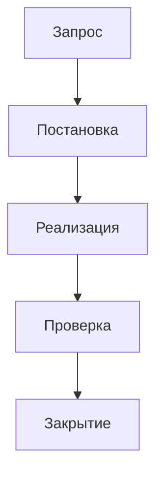

# Постановка: <краткое название>

## 1. Основание

- Инициатор:
- Дата:
- Контур/проект:
- Связанная задача/эпик:

## 2. Цель

Опишите, какой пользовательский или бизнес-результат должен быть получен.

## 3. Mermaid-схема

## 4. Пользовательские сценарии

| N | Сценарий | Роль пользователя | Ожидаемый результат |
|---|---|---|---|
| 1 |  |  |  |

## 5. Объекты Alterios

| Область | Объекты | Комментарий |
|---|---|---|
| Типы материалов / таблицы |  |  |
| Поля |  |  |
| Представления |  |  |
| Формы |  |  |
| Скрипты / BPMN |  |  |
| Отчеты |  |  |
| Иконки / действия |  |  |

## 6. Acceptance criteria

- [ ] Есть проверяемый пользовательский сценарий.
- [ ] Описаны затрагиваемые данные и интерфейсы.
- [ ] Определены проверки результата.
- [ ] Указано, что остается private и что может стать reusable MCP-улучшением.

## 7. Ограничения и риски

-

## 8. Ответственные по этапам

| Stage | Ответственное лицо | Роль | Артефакт | Статус |
|---|---|---|---|---|
| Intake |  | PM Control Loop |  | todo |
| Постановка |  | Business/System Analyst |  | todo |
| Discovery |  | Project Base Explorer |  | todo |
| Design |  | Profile engineer |  | todo |
| Build |  | Profile engineer |  | todo |
| Verify |  | Safety Verifier |  | todo |
| Docs/Git |  | Lead/Scribe |  | todo |

## 9. Git-решение

- [ ] Только private Gitea.
- [ ] Нужно reusable-изменение в `alterios-mcp`.
- [ ] Нужен отдельный issue/commit для MCP.
