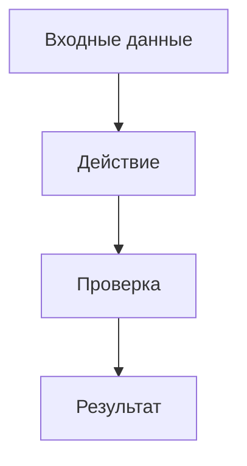

# Задача: <краткое название>

## 1. Метаданные

| Поле | Значение |
|---|---|
| Тип | feature / bug / research / verification / docs / chore |
| Sprint/Milestone |  |
| Ответственный владелец |  |
| Stage | Intake / Discovery / Design / Build / Verify / Docs-Git |
| Риск | low / medium / high |
| Private data | yes / no |

## 2. Постановка

Кратко опишите, что нужно сделать и зачем.

## 3. Mermaid-схема

## 4. Состав работ

| Область | Что сделать | Ответственный | Проверка |
|---|---|---|---|
| Типы материалов / таблицы |  |  |  |
| Поля |  |  |  |
| Представления |  |  |  |
| Формы |  |  |  |
| Скрипты / BPMN |  |  |  |
| Отчеты |  |  |  |
| Иконки / действия |  |  |  |
| MCP / skills / docs |  |  |  |

## 5. Acceptance criteria

- [ ] Результат виден пользователю или подтвержден readback.
- [ ] Все write-действия выполнены через gate.
- [ ] Проверки приложены в комментариях.
- [ ] Ответственные по stage указаны.
- [ ] Финальный отчет содержит описание решения и состав объектов.

## 6. Проверки

| Проверка | Команда / способ | Результат |
|---|---|---|
| Health / preflight |  |  |
| Dry-run |  |  |
| API readback |  |  |
| UI evidence |  |  |
| Tests |  |  |
| Sensitive scan |  |  |

## 7. Артефакты

-

## 8. Git-решение

- Public `alterios-mcp` changes:
- Private-only artifacts:
- Commit hash:

## 9. Closeout

- Что сделано:
- Что проверено:
- Что не проверено:
- Риски:
- Следующий шаг:
